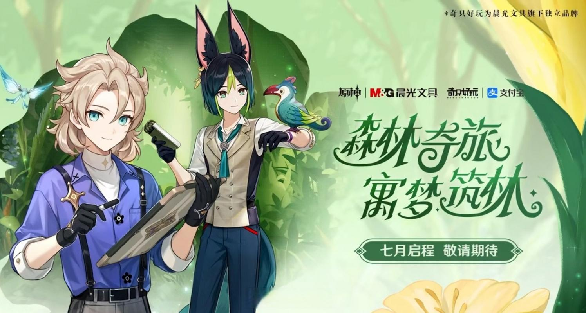

import GenshenTgaSrc from "./原神 TGA 2022.mp4";
import StarRailTgaSrc from "./崩铁 TGA.mp4";

export const GenshenTgaVideo = () => {
  return (
    

      <video
        width="100%"
        style={{ borderRadius: "var(--ifm-global-radius)" }}
        src={GenshenTgaSrc}
        controls
      >
        你的浏览器不支持播放视频
      </video>
    

  );
};

export const StarRailTgaVideo = () => {
  return (
    

      <video
        width="100%"
        style={{ borderRadius: "var(--ifm-global-radius)" }}
        src={StarRailTgaSrc}
        controls
      >
        你的浏览器不支持播放视频
      </video>
    

  );
};

## 时政

> ## 2023 蒸汽鸟报特刊（节选）
>
> ### 原神 × 三星堆博物馆线下活动
>
> 
>
> ### 《原神》入围 TGA 2023「最佳持续运营游戏」
>
> 中国第一款获得 TGA 提名的游戏是米哈游自主研发的《原神》。它获得了：
>
> - 2021 TGA「最佳移动游戏」奖项；
> - 2022 TGA「玩家之声」奖项；
> - 2023 TGA「最佳持续运营游戏」奖项。
>
> 除了《原神》之外，米哈游的《崩坏：星穹铁道》也获得了 TGA「最佳移动游戏」奖项。
>
> #### 《原神》TGA 2022 参选视频
>
> <GenshenTgaVideo />
>
> #### 《崩坏：星穹铁道》TGA 参选视频「常看常新的故事」
>
> <StarRailTgaVideo />
>
> ### 原神 × 鸿蒙 - 原生，启动！
>
> 
>
> ### 原神 × 支付宝 - 绿色出行
>
> 实现的碳减排已累计达到 20000 吨，相当于种下 100 万棵梭梭树。
>
> 
>
> 
记者：朗镜索真 · 夏洛蒂

## 点评

原神与三星堆博物馆联动，推动了广大旅行者（原神玩家）积极参与、了解三星堆文化。我国文化源远流长，博大精深、薪火相传，历久弥新，需要更多的人来继承和发展。原神在游戏中融入历史，并对外输出中国文化，使外国人渐渐了解中国文化，
