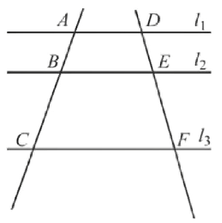
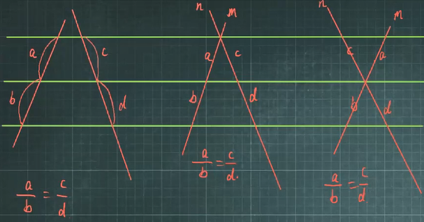
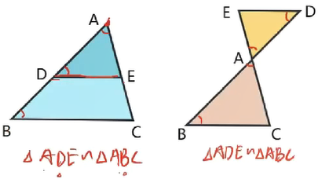
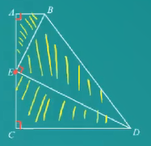

---
last_update:
  date: 1694267720788
---

## 比例线段

对于四条线段 $a$，$b$，$c$，$d$ 如果两条线段的比（即它们长度的比）与另两条线段的比相等，如 $\frac{a}{b} = \frac{c}{d} (ad=bc)$，我们就说这四条线段成比例。

### 比例性质

$$
\frac{a}{b} = \frac{c}{d} ⇔ \frac{a}{c} = \frac{b}{d}
$$

$$
\frac{a}{b} = \frac{b}{c} → b^2 = ac
$$

### 比例中项

如果 $a$、$b$、$c$ 三个量成比例即 $a:b = b:c$，$b$ 叫做 $a$ 和 $c$ 的比例中项。

#### 例子

$$
1:2=2:4
$$

$2$ 是 $1$ 和 $4$ 的比例中项。

## 平行线分线段成比例

### 性质

两条直线被一组平行线所截，所得的对应线段成比例。

### 几何语言

$$
∵ l_1 // l_2 // l_3
$$

$$
∴\frac{AB}{BC} = \frac{DE}{EF}\text{（上比下 = 上比下）}
$$

$$
∴\frac{AB}{AC} = \frac{DE}{DF}\text{（上比全 = 上比全）}
$$

$$
∴\frac{BC}{AC} = \frac{EF}{DF}\text{（下比全 = 下比全）}
$$

## 相似三角形

### 定义

在 $\triangle ABC$ 和 $\triangle A'B'C'$ 中，  
如果 $∠A = ∠A'$，$∠B = ∠B'$，$∠C = ∠C'$，$\frac{AB}{A'B'} = \frac{BC}{B'C'} = \frac{AC}{A'C'} = k$，  
即三个角分别相等，三条边成比例，  
我们就说 $\triangle ABC$ 与 $\triangle A'B'C'$ 相似，相似比为 $k$。  
相似用相似符号“$∽$”表示，读作“相似于”。  
$\triangle ABC$ 与 $\triangle A'B'C'$ 相似，记作 $\triangle ABC∽\triangle A'B'C'$。

### 判定

#### 预备定理

平行于三角形一边的直线和其他两边相交，所构成的三角形与原三角形相似。

##### 几何语言

$$
∵DE//BC
$$

$$
∴\triangle ADE∽\triangle ABC
$$

#### 判定定理 $AA$

两角分别相等的两个三角形相似。

##### 几何语言

$$
∵∠A = ∠A', ∠B = ∠B'
$$

$$
∴\triangle ABC ∽ \triangle A'B'C'
$$

#### 判定定理 $SAS$

两边成比例且夹角相等的两个三角形相似。

##### 几何语言

$$
∵\frac{AB}{A'B'} = \frac{AC}{A'C'}, ∠A = ∠A'
$$

$$
∴\triangle ABC ∽ \triangle A'B'C'
$$

#### 判定定理 $SSS$

三边成比例的两个三角形相似。

##### 几何语言

$$
∵\frac{AB}{A'B'} = \frac{BC}{B'C'} = \frac{AC}{A'C'}
$$

$$
∴\triangle ABC ∽ \triangle A'B'C'
$$

### 性质

#### 性质 1

相似三角形的对应角相等。

##### 几何语言

$$
∵\triangle ABC∽\triangle A'B'C'
$$

$$
∴∠A=∠A', ∠B=∠B', ∠C=∠C'
$$

#### 性质 2

相似三角形的对应边成比例。

##### 几何语言

$$
∵\triangle ABC∽\triangle A'B'C'
$$

$$
∴\frac{AB}{A'B'}=\frac{BC}{B'C'}=\frac{AC}{A'C'}=k
$$

#### 性质 3

相似三角形对应高的比，对应中线的比与对应角平分线的比都等于相似比（对应线段的比值均为相似比）。

#### 性质 4

相似三角形周长的比等于相似比。

##### 几何语言

$$
∵\triangle ABC∽\triangle A'B'C'
$$

$$
∴\frac{C_{\triangle ABC}}{C_{\triangle A'B'C'}}=k
$$

#### 性质 5

相似三角形面积的比等于相似比的平方。

##### 几何语言

$$
∵\triangle ABC∽\triangle A'B'C'
$$

$$
∴\frac{S_{\triangle ABC}}{S_{\triangle A'B'C'}}=k^2
$$

### 一线三垂直相似模型

如果：$∠A=∠C=∠BED=90°$，又 $E$ 为 $AC$ 中点，则：$\triangle ABE∽\triangle CED∽\triangle EBD$。

### 鸡在河上（积在和上）

在 $\triangle ABC$ 中，边 $BC=x$,高 $AD=y$,四边形 $EFGH$ 是边长为 $a$ 的正方形，则有：

$$
a = \frac{xy}{x+y}
$$

### 手拉手模型

$$
\triangle ABC ∽ \triangle ADE \iff \triangle ABD ∽ \triangle ACE
$$

$$
∠BAC = ∠DAE \iff ∠BAD = ∠CAE
$$

$$
\frac{AB}{AD}=\frac{AC}{AE} \iff \frac{AB}{AC}=\frac{AD}{AE}
$$
