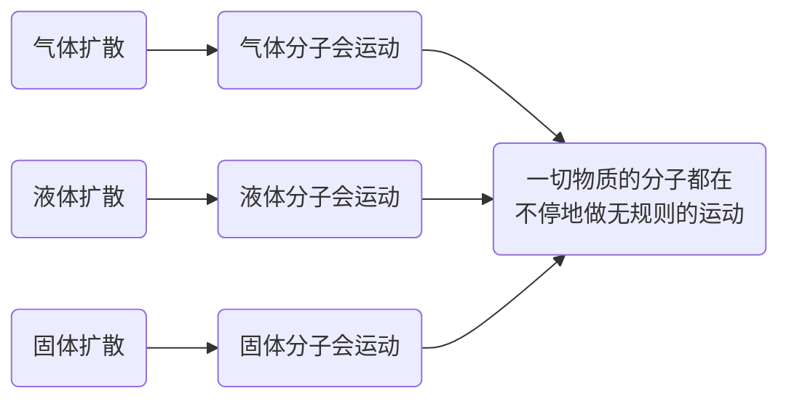
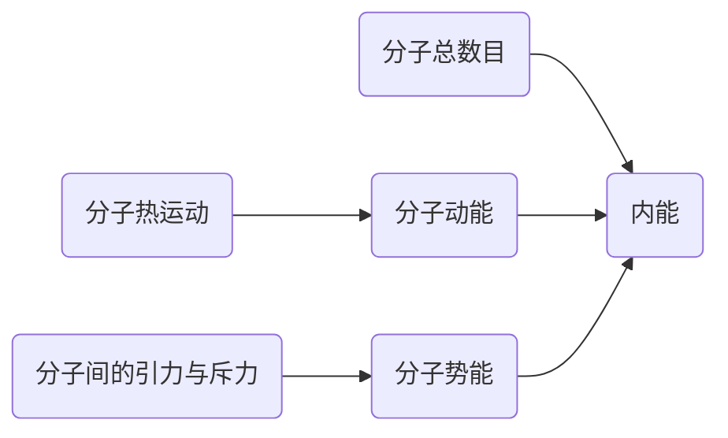

---
last_update:
  date: 1703948696793
---

## 分子大小

约 $10^{-10}m$，

:::warning 注意
分子很小，肉眼无法看到，灰尘颗粒不属于分子，因此 **灰尘飞舞** 不属于 **分子的热运动**。
:::

## 扩散现象

不同的物质在互相 **接触** 时彼此进入对方的现象，叫做扩散现象。

由扩散现象得出 **一切物质的分子都在不停地做无规则的运动**。

## 分子热运动

温度越高，分子运动越剧烈，分子这种无规则运动叫做分子的热运动。

微观：分子热运动；  
宏观：扩散现象。

### 固体

固体有体积、形状，  
固体分子只能在 **固定位置** 附近不停的振动，就像学生整齐的排好队，只能在原地小范围活动。

### 液体

液体有体积、形状，  
相比固体分子，液体分子可以 **自由移动**，但不能移动得太远，就像学生在操场做游戏，在 **一定范围内活动**。

### 气体

气体没有体积、形状，  
气体分子则向各个方向 **自由移动**，就像学生放学自由活动，**没有范围限制**。

## 分子势能

### 引力

所有物质的分子之间都存在引力，正是分子间的引力，使得固体、液体的分子不致散开，也因此固体、液体能保持一定的体积。

### 斥力

分子之间除了引力以外，分子之间还存在斥力[^1]。

:::warning 注意
分子间发生相互作用力的距离 **很短**[^2] 而且引力和斥力是 **同时存在** 的。
:::

- 当固体被 **压缩** 时，分子间的 **距离变小** ，作用力表现为 **斥力**[^3]；
- 当固体被 **拉伸** 时，分子间的 **距离变大** ，作用力表现为 **引力**[^4]。

固体分子间的 **距离小**[^5]，**不容易** 被压缩和拉伸，所以固体具有一定的 **体积和形状**。

如果分子相距很远[^6]，作用力就变得十分微弱，如同气体的分子。  
气体分子之间的距离很远，彼此之间几乎没有作用力，因此气体具有 **流动性**，**容易被压缩**。

通常液体分子之间的距离比气体的小，比固体的大。  
液体分子之间的作用力比固体的小，分子 **没有固定的位置**，运动 **比较自由**。  
这样的结构使得液体 **较难被压缩**[^7]，**没有确定的形状**，具有 **流动性**。

## 分子动理论

1. 常见的物质是由大量的分子、原子构成的；
2. 物质内的分子在不停地做热运动 --> **分子热运动** --> **分子动能**；
3. 分子之间同时存在引力和斥力 --> **分子势能**。

[^1]: 固体和液体很难被压缩的原因。
[^2]: 约为 $10^{-10}m$。
[^3]: 分子间的斥力 **大于** 引力（合力为斥力）。
[^4]: 分子间的引力 **大于** 斥力（合力为引力）。
[^5]: 相对 **液体分子** 和 **气体分子** 而言。
[^6]: 分子间距离大于 $10^{-9}m$。
[^7]: 与固体对比。

## 分子动能

微观上，物质由大量分子、原子构成的，分子在不停地做无规则运动。  
**分子具有动能，叫作分子动能**。  
温度越高，分子热运动越剧烈，分子动能也就越大。

## 内能

### 定义

构成物体的 **所有分子**，其热运动的 **分子动能** 和相互作用的 **分子势能** 的总和。

### 单位

焦耳（$J$）。

:::warning 注意
内能是指物体具有的能量，不是一个分子具有的能量，而是 **物体内部所有分子** 具有的 **总能量**。
:::

物体 **温度降低** 时 **内能减少**，**温度升高** 时 **内能增加**。  
这里的“物体”是指 **同一个物体**，就我们现有的初中知识，可认为是该物体的分子数目不变、分子势能不变，当温度升高，分子热运动的剧烈程度越大，分子动能越大，所以物体的内能越大；反之温度越低，内能越小。

:::info
断裂的玻璃**高温烧软**，**挤压**之后可以**重新结合**在一起  
通过高温烧软后挤压的方式，可以让“破镜重圆”。因为玻璃烧软之后，挤压更容易使接触面的分子之间的距离缩小，当分子间的距离缩小到分子间作用力表现为引力时，玻璃也就可以结合在一起了。
:::
