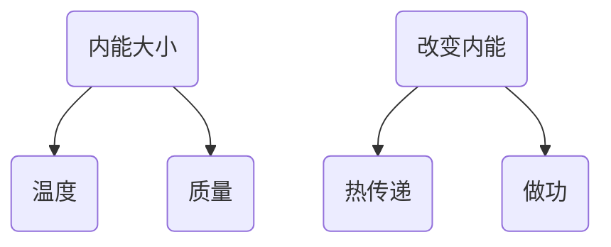

---
last_update:
  date: 1699191898316
---

## 分子动能和分子势能

### 分子动能

分子在不停地做热运动，温度越高，分子热运动越剧烈，动能越大。

### 分子势能

分子间存在类似弹簧形变时的相互作用力，因此分子具有势能，叫做分子势能。

## 内能

**所有分子** 的 **分子动能** 和 **分子势能** 的总和。

:::warning
各种形式能量的单位都是焦耳（$J$）。  
一切物体，不论温度高低，都具有内能。
:::

:::warning

- 对内做功，温度升高，内能增加；
- 对外做功，温度降低，内能减少。

:::

### 热传递

温度差导致热传递，高温向低温传递。

传递能量的多少叫做 **热量**，单位：焦耳（$J$）。
