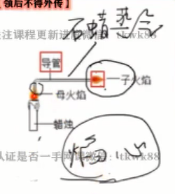

---
last_update:
  date: 1699191898091
---

## 实验探究步骤

1. 提出问题；
2. 猜想与假设；
3. 查阅资料；
4. 进行实验；
5. 得出结论；
6. 反思与评价[^1]。

[^1]: 题目难度较大。

## 蜡烛燃烧实验

:::info 提示
可以用 **排水法** 收集呼出气体。
:::

:::warning 警告
描述实验现象时要把 **对照组** 和 **实验组** 都描述一遍。
:::

由内到外：焰心、內焰、外焰。

外焰温度最高，因为外焰与空气接触地最充分，所以燃烧最充分。

:::info 提示
一般只有 **气体燃烧** 才会产生火焰，因此其实是 **石蜡蒸汽燃烧**。  
**焰心** 石蜡蒸汽最多，因此 **可以** 产生子母火焰。  
**外焰** 的石蜡蒸汽充分燃烧，因此 **无法** 产生子母火焰。  
**內焰** 勉强 **可以** 产生子母火焰。

用 **导管**[^2] 导出 **焰心** 或 **內焰** 的 **石蜡蒸汽**，然后在导管的尽头 **点火**。

1. 玻璃管要伸入到 **焰心**；
2. 玻璃管不能太长。

:::

[^2]: 导管不能太长，因为石蜡蒸汽的温度在不断下降，可能会在导管内形成石蜡固体。

- 蜡烛 **熄灭** 时的 **白烟** —— 石蜡固体小颗粒；
- 蜡烛 **燃烧** 时的 **黑烟** —— 蜡烛未充分燃烧。

:::warning 警告
描述 **实验现象** 时，不能出现 **物质的名称**，否则属于 **实验结论**。
:::

:::info 提示
物质燃烧要 **产生火焰** 燃烧时的温度必须 **超过沸点**。
:::

## 酒精灯的使用

- 不能用 **酒精灯** 去 **点燃** 另一个 **酒精灯**；
- 液体加热时，液体体积不能超过试管容积的 $\frac{1}{3}$。

## 天平的使用

- 被称物不直接放在托盘上（**干燥固体** 可用 **称量纸**，**易潮解**、**腐蚀性** 药品用 **玻璃器皿**），**不能** 称量 **热** 的物体；
- 一般精确到 $0.1 g$；
- **左** 盘放称量 **物**，**右** 盘放砝 **码**[^3]，读数方法是：**物体质量 = 砝码质量 + 游码质量**。

[^3]: 左物右码。

## 量筒的使用

- 当向量筒中倾倒液体接近所需刻度时（离刻度 $1$ ~ $2$ $mL$），停止倾倒，余下部分用 **胶头滴管** 滴加药液至所需刻度线；
- 读数时，量筒必须放 **平**；
- 读数时视线要与量筒内 **凹液面的最低处** 保持水平；
- 量筒只可用来量取液体，不能加热，不能用作反应容器，不能用来配制溶液；
- 应选一次性量取的最小量程的量筒。

:::info 量筒误差口诀
俯视：读大实小[^4]。
:::

[^4]: 读数大于实际。
