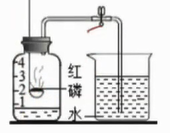

---
last_update:
  date: 1699191898167
---

## 空气中氧气含量的测定

### 空气的组成

|  空气的成分  | $N_2$ | $O_2$ | 稀有气体 | $CO_2$  | 其他气体和杂质 |
| :----------: | :---: | :---: | :------: | :-----: | :------------: |
| **体积分数** | $78$% | $21$% | $0.94$%  | $0.03$% |    $0.03$%     |

:::warning 警告

- 空气成分 **百分比** 指的是 **体积分数**，不是质量分数；
- 名称（氧气）+ 化学式（$O_2$）+ 体积分数（$21$%）。

:::

大

- 目前计入空气污染指数的项目暂定为：**二氧化硫**、**一氧化碳**、**二氧化氮**、**可吸入颗粒物**（粒径在 10 微米以下的颗粒物，称 $PM_{10}$，又称飘尘）和 **臭氧** 等；

- 二氧化硫和二氧化氮是形成酸雨的主要污染物；一氧化碳易使人中毒；
- **二氧化碳** 会造成温室效应，但 **不是污染物**。

:::warning 易错
空气 **质量级别** 越高，污染越大。

| 污染指数 | 50 以下 | 51 ~ 100 | 101 ~ 150 | 151 ~ 200 | 201 ~ 250 | 251 ~ 300  | 300 以上 |
| :------: | :-----: | :------: | :-------: | :-------: | :-------: | :--------: | :------: |
| 质量级别 |    Ⅰ    |    Ⅱ     |  Ⅲ（1）   |  Ⅲ（2）   |  Ⅳ（1）   |   Ⅳ（2）   |    Ⅴ     |
| 质量状况 |   优    |    良    | 轻微污染  | 轻度污染  | 中度污染  | 中度重污染 | 重度污染 |

:::

### 空气中氧气含量的测定

#### 实验步骤

1. 检查装置 **气密性**；
2. 集气瓶中预先要加入少量水[^1]，把集气瓶 **剩余容积** 五等分，**夹紧** 弹簧夹；
3. 点燃燃烧匙内的 **足量（过量）**[^2] 红磷后，**迅速** 伸入集气瓶内，塞紧瓶塞，观察现象；
4. 待集气瓶冷却到 **室温** 后，打开弹簧夹，观察现象。

[^1]:
    - 吸收白烟；
    - 吸收热量，加速冷却。

[^2]: 为了充分消耗氧气。

#### 原理

利用红磷燃烧消耗密闭容器内空气中的氧气，使密闭容器内压强减小，在大气压的作用下，进入容器内水的体积即为减少的氧气的体积。

#### 药品选择

- 碳、硫和蜡烛燃烧产生其他气体，导致结果不准；
- 白磷实验结果跟红磷一样，但白磷是剧毒的；
- 铁无法在空气中燃烧；
- 镁不仅能与空气中的氧气反应，还会与氮气和二氧化碳反应。

##### 可燃物选择标准

- 在空气中 **能燃烧** 且只能跟 **氧气** 反应，不能与空气中的其他成分反应；
- 燃烧后生成物 **不能** 为 **气态**。

#### 表达式

文字表达式：$\text{红磷} + \text{氧气} \xrightarrow{\text{点燃}} \text{五氧化二磷}$；  
符号表达式：$P + O_2 \xrightarrow{\text{点燃}} P_2O_5$。

#### 实验现象

红磷剧烈燃烧，产生大量白烟，放热，待装置完全冷却后打开弹簧夹，烧杯中的水倒吸入集气瓶中，约占集气瓶内 **空气体积** 的 $\frac{1}{5}$。

#### 实验结论

氧气约占空气体积的 $\frac{1}{5}$。

#### 误差分析

##### 导致结果偏小的原因

- 红磷的量 **不足**；
- 装置 **漏气**（如瓶塞未塞紧等），使外界空气进入瓶内；
- **未冷却至室温** 就打开弹簧夹，使进入瓶内的水的体积减少。

##### 导致结果偏大的原因

- 点燃红磷后，插入燃烧匙时，瓶塞 **塞得太慢**，瓶中空气受热膨胀，部分空气逸出；
- 实验开始时，**没有夹** 或 **没有夹紧** 弹簧夹，瓶中空气受热膨胀，部分空气逸出。

## 氧气的性质

### 物理性质

- 标况下无色无味，密度略大于空气，不易溶于水；
- $1.01×10^5kPa$，$-183^{\circ}C$ 淡蓝色液体；
- $1.01×10^5kPa$，$-218.4^{\circ}C$ 淡蓝色雪花状固体。

### 化学性质

- 供给呼吸；
- 支持燃烧。

### 物质在氧气中燃烧

| 反应物名称 | 反应物颜色及状态 |                          在空气中的燃烧现象                          |                          在氧气中的燃烧现象                          |                  符号表达式                  |
| :--------: | :--------------: | :------------------------------------------------------------------: | :------------------------------------------------------------------: | :------------------------------------------: |
|    红磷    |     红色固体     |                     产生大量 **白烟**[^3]，放热                      |                剧烈燃烧，产生大量 **白烟**[^3]，放热                 |  $P + O_2 \xrightarrow{\text{点燃}} P_2O_5$  |
|     硫     |    淡黄色固体    | 发出微弱的 **淡蓝色** 火焰，生成无色、有 **刺激性** 气味的气体，放热 | 发出明亮的 **蓝紫色** 火焰，生成无色、有 **刺激性** 气味的气体，放热 |   $S + O_2 \xrightarrow{\text{点燃}} SO_2$   |
|    木炭    |  **黑** 色固体   |       **红热**，生成无色无味、能使澄清石灰水变浑浊的气体，放热       |    发出 **白光**，生成无色无味、能使澄清石灰水变浑浊的气体，放热     |   $C + O_2 \xrightarrow{\text{点燃}} CO_2$   |
|    铁丝    |    银白色固体    |                                不燃烧                                |         **剧烈燃烧**，**火星四射**，生成黑色固体，放出大量热         | $Fe + O_2 \xrightarrow{\text{点燃}} Fe_3O_4$ |
|    镁条    |    银白色固体    |           剧烈燃烧，发出 **白光**，放热，生成 **白色固体**           |           剧烈燃烧，发出 **白光**，放热，生成 **白色固体**           |   $Mg + O_2 \xrightarrow{\text{点燃}} MgO$   |

[^3]: 只能称为白烟。白雾、白色烟雾都是错误说法。

:::warning 警告
描述 **实验现象** 时，不能出现 **物质的名称**，否则属于 **实验结论**。
:::
:::warning 警告
带火星的木条可以在 **氧气** 中 **复燃**，在空气中无明显变化。
:::

## 化合反应与氧化反应

### 化合反应的概念

两种或两种以上物质生成另一种物质的反应（**多变一**）叫做化合反应，属于化学基本反应类型。

### 氧化反应的概念

物质与氧气发生的反应叫做氧化反应[^4]。（不属于化学基本反应类型，是特征反应）

[^4]: 分为 **剧烈氧化** 和 **缓慢氧化**。

:::warning 警告
有些氧化反应进行得很慢，甚至不容易被察觉，这种氧化叫做缓慢氧化，如动植物呼吸、食物腐烂、酿酒、酿醋等。
:::

### 化合反应与氧化反应的关系

