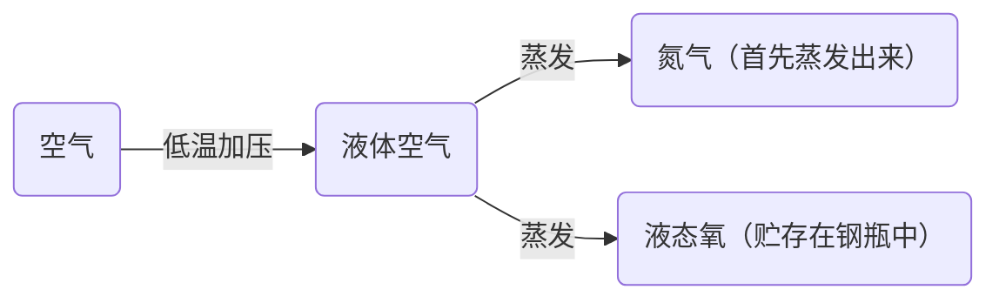
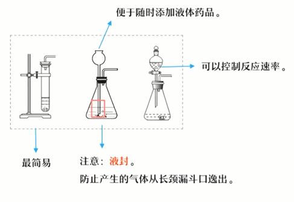

---
last_update:
  date: 1699191898184
---

## 工业制氧气

### 方法

分离液态空气法。

### 原理

利用 $N_2$、$O_2$ 的沸点不同，这是一个 **物理变化** 的过程。

## 实验室制取氧气

### 实验原理

$$
\text{高锰酸钾} \xrightarrow{\text{加热}} \text{锰酸钾} + \text{二氧化锰} + \text{氧气}
$$

$$
KMnO_4 \xrightarrow{\bigtriangleup} K_2MnO_4 + MnO_2 + O_2↑
$$

:::warning 警告
高锰酸钾是 **暗紫色** / **紫黑色**  
二氧化锰是 **黑色**
:::

$$
\text{过氧化氢} \xrightarrow{\text{二氧化锰}} \text{水} + \text{氧气}
$$

$$
H_2O_2 \xrightarrow{MnO_2} H_2O + O_2↑
$$

$$
\text{氯酸钾} \xrightarrow[\text{加热}]{\text{二氧化锰}} \text{氯化钾} + \text{氧气}
$$

$$
KClO_3 \xrightarrow[\bigtriangleup]{MnO_2} KCl + O_2↑
$$

### 发生装置的选择

#### 固固加热型

- 固体
- 加热（$\bigtriangleup$）

#### 固液不加热型

- 固体 + 液体
- 常温

### 收集装置的选择

#### 排水法

氧气不易溶于水且不与水反应
