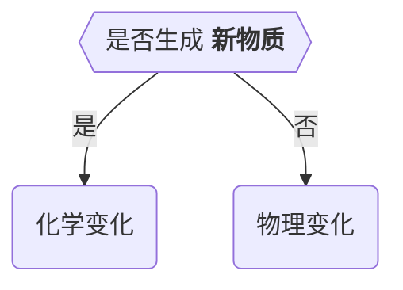
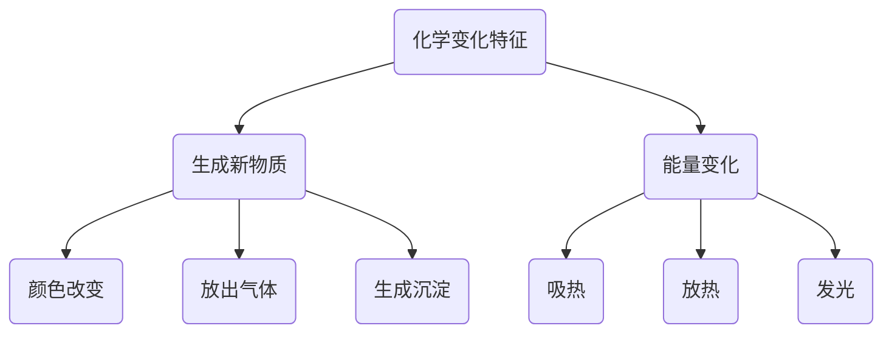
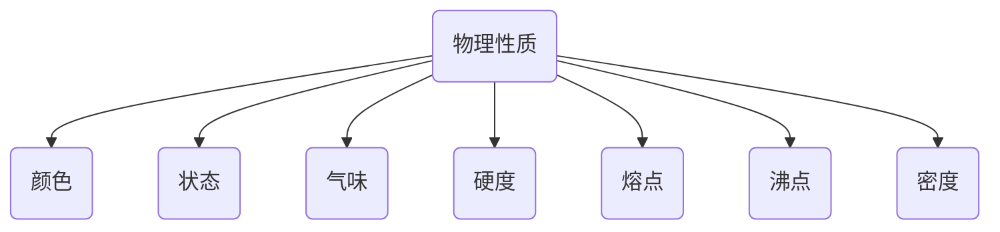
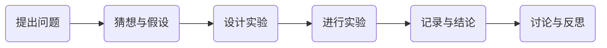
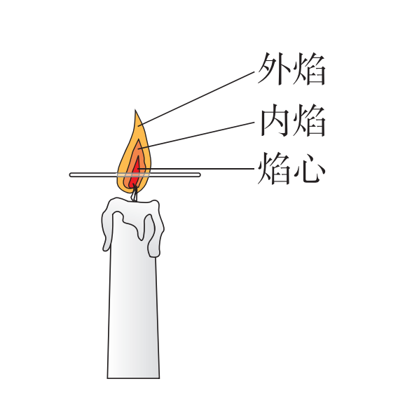
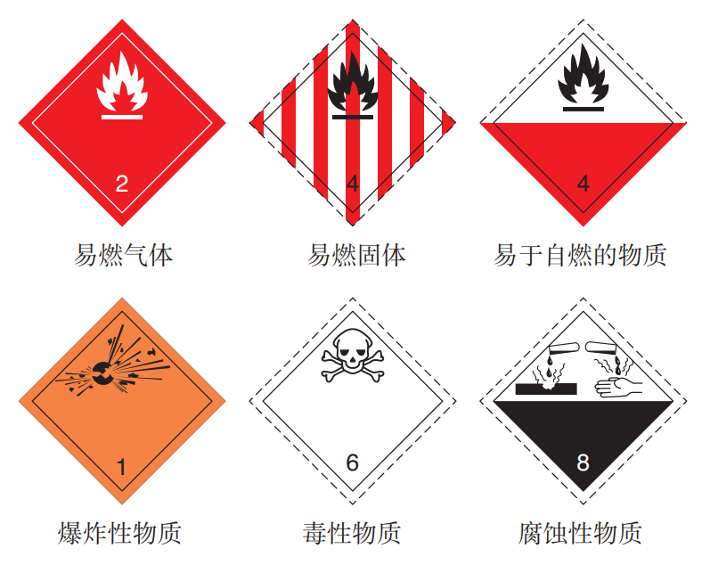

---
last_update:
  date: 1704107492386
---

## 绪言

### 化学发展史

**道尔顿** 和 **阿伏加德罗** 等科学家：**物质是由原子和分子构成的，分子中原子的重新组合是化学变化的基础**。原子论和分子学说的创立，奠定了近代化学的基础。

1869 年，**门捷列夫** 发现了元素周期律并编制出 **元素周期表**。

### 化学概念

化学是在 **分子、原子** 层次上研究物质 **性质、组成、结构与变化规律** 的自然科学。

**绿色化学** 的提出，使更多的化学生产工艺和产品向着环境友好的方向发展。

## 物质的变化和性质

### 化学变化和物理变化

:::tip 方法导引

做化学实验时，应该重点观察试剂（如水、胆矾、石灰石）的颜色、状态、气味等在实验前后发生的变化，思考为什么发生变化。

:::

化学变化的过程中，会 **同时发生物理变化**。

### 化学性质和物理性质

- 化学性质：在 **化学变化** 中表现出来的性质。
- 物理性质：**不需要化学变化** 表现出来的性质。

:::warning

描述物质性质时往往要 **注明条件**。

:::

大气压强 **不是固定不变** 的，人们把 $101 kPa$ 规定为标准大气压强。

:::tip

闻气体时应该小心，用手轻轻地在瓶口扇动，使极少量的气体飘进鼻孔。

:::

### 练习与应用

1. 下列事例哪些是物理变化，哪些是化学变化？并简要说明判断的理由。
   1. 铁生锈。
   2. 石蜡熔化。
   3. 纸张燃烧。
   4. 酒精挥发。
   5. 水变成水蒸气。
   6. 潮湿的衣服被晒干了。
   7. 下雪后天气晴暖，雪融化。
   8. 在寒冷的冬天向窗玻璃上哈气，会出现一层水雾。
   9. 以粮食为原料酿酒。
   10. 石灰石（或大理石）遇到盐酸后会生成二氧化碳和水。
2. 物理变化和化学变化的主要区别是什么？如何判断物质是否发生化学变化？举例说明。
3. 观察你身边的物质，如水、食盐、蔗糖、铜导线等，描述一下它们的性质和用途（可以查阅有关的资料）。
4. 生活经验告诉我们，食物都有一定的保质期，绝不能食用变质的食物。哪些现象可以帮助我们来判断食物已经变质了？举例说明。

## 化学是一门以实验为基础的科学

对蜡烛及其燃烧的探究活动（P12），体现了化学学习的以下特点：

1. 关注物质的 **性质**
   - **物理性质**：石蜡的颜色、状态、气味、硬度、密度、熔点等；
   - **化学性质**：石蜡能否燃烧、燃烧产物能否使澄清石灰水变浑浊等。
2. 关注物质的 **变化**
   - **物理变化**：受热时石蜡熔化等；
   - **化学变化**：燃烧时发光、放热的现象，有二氧化碳和水的生成等。
3. 关注物质变化的 **过程** 以及对结果的 **解释和讨论**。对物质在 **变化前**、**变化中**、**变化后** 的现象进行细致观察、如实记录，并进行比较和分析，以得出可靠的结论，最后认真填写报告。

:::warning

- 气：气体
- 雾：液体
- 烟：固体

:::

- 外焰：氧气充足，温度最高
- 内焰：温度中等
- 焰心：氧气不足，温度最低，焰心燃烧不完全，留有石蜡蒸汽，可用导管导出，形成子母火焰

熄灭后，有白烟（石蜡固体小颗粒）产生，点燃白烟后复燃。

:::warning

与 **集气瓶** 配套使用的玻璃片一般是 **毛玻璃**，使用时应将玻璃片的 **毛面** 向下盖好集气瓶。

:::

## 走进化学实验室

### 实验室化学药品取用规则

1. 不摸，不闻，不尝
2. 节约药品。一般按最少量（$1$ ~ $2 mL$）取用液体，固体只需盖满试管底部即可。
3. 剩余药品不能放回原瓶、不要随意丢弃、不要拿出实验室，要放入指定的容器内。

### 固体药品的取用

1. **保存**：**广口瓶** 里。
2. **取用**：一般用 **药匙**， **块状** 可用 **镊子** 夹取。
3. 用过的药匙或镊子要 **立刻用干净的纸擦拭干净**，以备下次使用。
4. 密度较大的块状药品或金属颗粒放入玻璃容器时：
   1. **容器横放**；
   2. 药品 **放入容器口**；
   3. **容器慢慢地竖立**；
   4. 药品 **缓缓地滑到底部**。
5. 往试管里装入固体粉末时：
   1. **试管倾斜**；
   2. 药匙（或纸槽）**送至试管底部**；
   3. **试管竖立**。

### 液体药品的取用

1. **保存**：**细口瓶** 里。
2. **取用**：常用 **倾倒法** 取用。
3. 常用 **量筒** 量出体积。量液时，量筒必须 **放平**，视线要与量筒内液体 **凹液面的最低处** 保持 **水平**，再读出液体的体积。
4. 取用少量液体时还可用 **滴管**。
   1. 取液后的滴管，应保持 **橡胶胶帽在上**，**不要平放或倒置**，防止液体倒流，沾污试剂或腐蚀橡胶胶帽；
   2. 不要把滴管放在实验台或其他地方，以免沾污滴管。用过的滴管要 **立即用清水冲洗干净**（滴瓶上的滴管不要用水冲洗），以备再用。严禁用未经清洗的滴管再吸取其他试剂。
