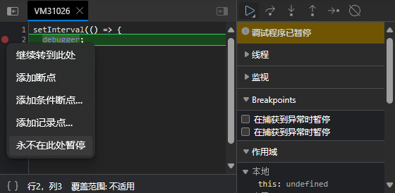
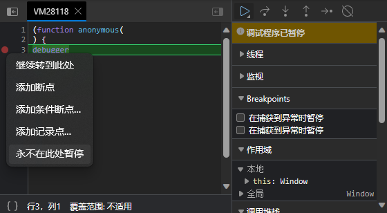
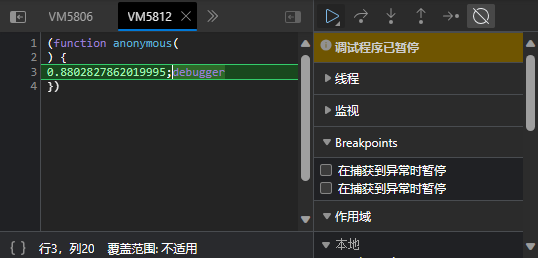

---
last_update:
  date: 1694267720815
---

## 初级

### 示例

```js
setInterval(() => {
  debugger;
});

setTimeout(function t() {
  debugger;
  setTimeout(t);
});

setInterval("debugger");

setInterval(Function("debugger"));
```

### 破解方法



## 中级

### 示例

```js
setInterval("1;debugger");
```

### 破解方法



## 高级

### 示例

```js
setInterval(() => Function(`${Math.random()};debugger`)());
```


