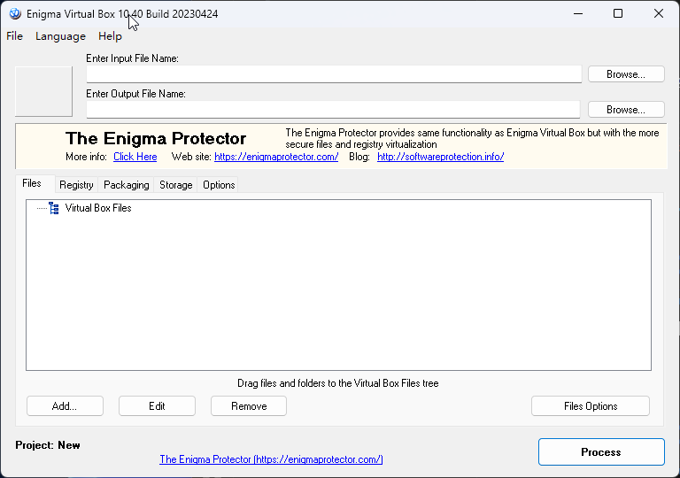
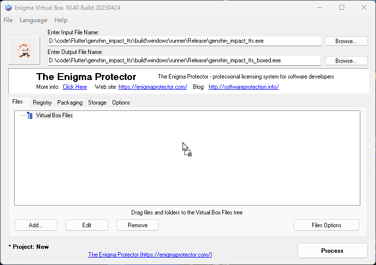
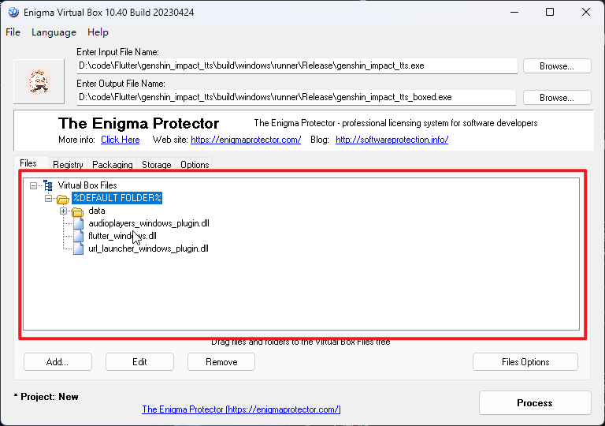
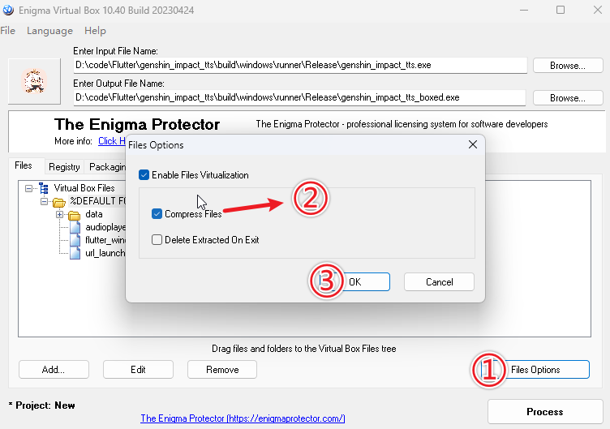

---
last_update:
  date: 1698565434218
---

## Enigma Virtual Box

### 下载

官网链接：[Enigma Virtual Box](https://enigmaprotector.com/assets/files/enigmavb.exe '{"target": "_self", "download": "Enigma Virtual Box.exe"}')  
免安装版链接：[Enigma Virtual Box](<Enigma Virtual Box.exe> '{"target": "_self", "download": "Enigma Virtual Box.exe"}')

### 安装

下载后无脑下一步就行了

### 用法

1. 点击 `Enter Input File Name` > `Browse...`，选择主程序

   

2. 把主程序目录下的其他文件拖到软件窗口中

   

3. 它会弹出一个窗口，点击 `OK`

   

   界面会变成这样

   

4. 点击 `File Options` > `Compress Files` 开启文件压缩（文件体积变小，会减慢启动速度，可选）

   

5. 点击 `Process` 开始处理

   

6. `Enter Output File Name` 的输入框内就是输出文件的路径

   
