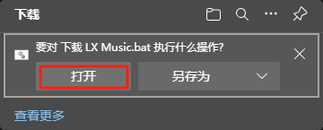
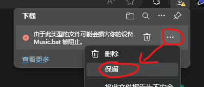
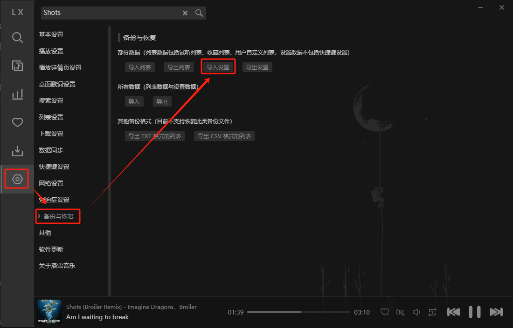

---
last_update:
  date: 1700360942828
---

# 免费听音乐

## 下载 [LX Music](https://lxmusic.toside.cn/)

### 下载地址

#### 国内下载

- Windows

  - 使用脚本下载（推荐）  
    [下载脚本](./下载%20LX%20Music.bat '{"download":"下载 LX Music.bat","target":"_self"}')
    :::tip

    1. 直接点打开 
    2. 再点保留 

    :::

  - 使用终端下载
    ```bash
    winget install "lyswhut.lx-music-desktop"
    ```
  - <a href="https://wwrb.lanzouw.com/i1M6p1f7xqgj" target="_self" download="LX Music Windows x64.exe" title='{"lanzoui":"aa"}'>Windows x64</a>
  - <a href="https://wwrb.lanzouw.com/iKKeS1f7xktg" target="_self" download="LX Music Windows arm 64.exe" title='{"lanzoui":"aa"}'>Windows arm 64</a>

- Mac
  - <a href="https://wwrb.lanzouw.com/iI0ob1f7xx5a" target="_self" download="LX Music Mac x64.dmg" title='{"lanzoui":"aa"}'>Mac x64</a>
  - <a href="https://wwrb.lanzouw.com/idW471f7xhed" target="_self" download="LX Music Mac arm 64.dmg" title='{"lanzoui":"aa"}'>Mac arm 64</a>

:::tip

如果提示需要密码，请输入 `aa`

:::

#### 国外下载

[GitHub](https://github.com/lyswhut/lx-music-desktop/releases)

## 配置 [LX Music](https://lxmusic.toside.cn/)

### 下载配置文件

[点击下载](lx_setting_v2.lxmc '{"download":"lx_setting_v2.lxmc","target":"_self"}')

### 导入配置文件

1. 设置 > 备份与恢复 > 导入设置
   
2. 选择你刚刚下载的配置文件
