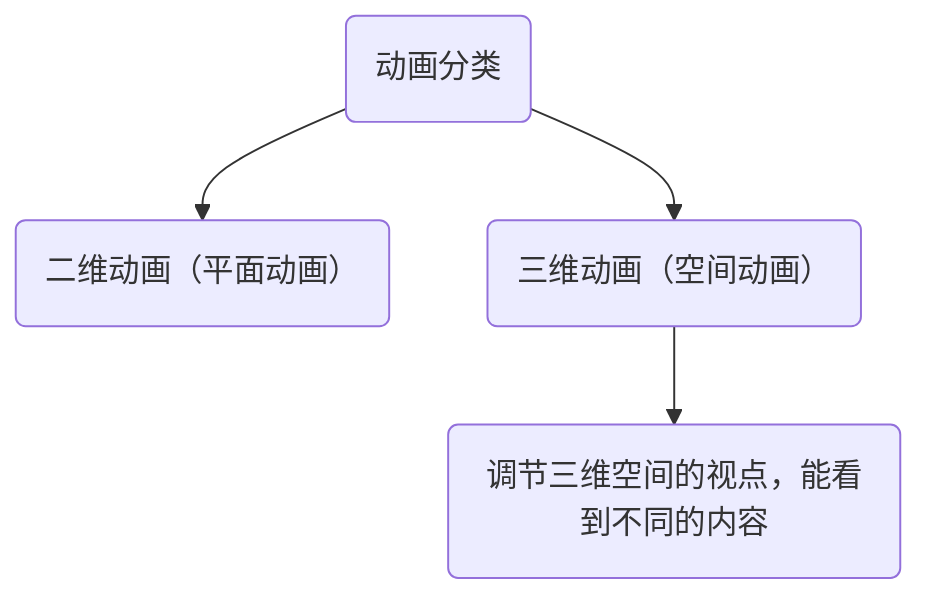
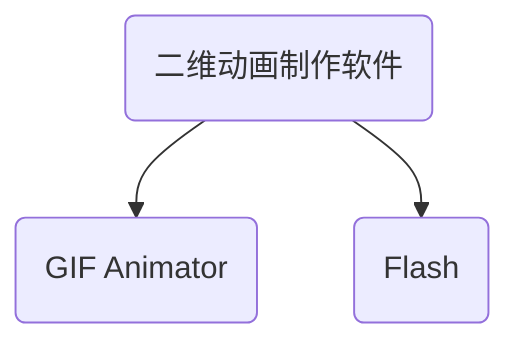
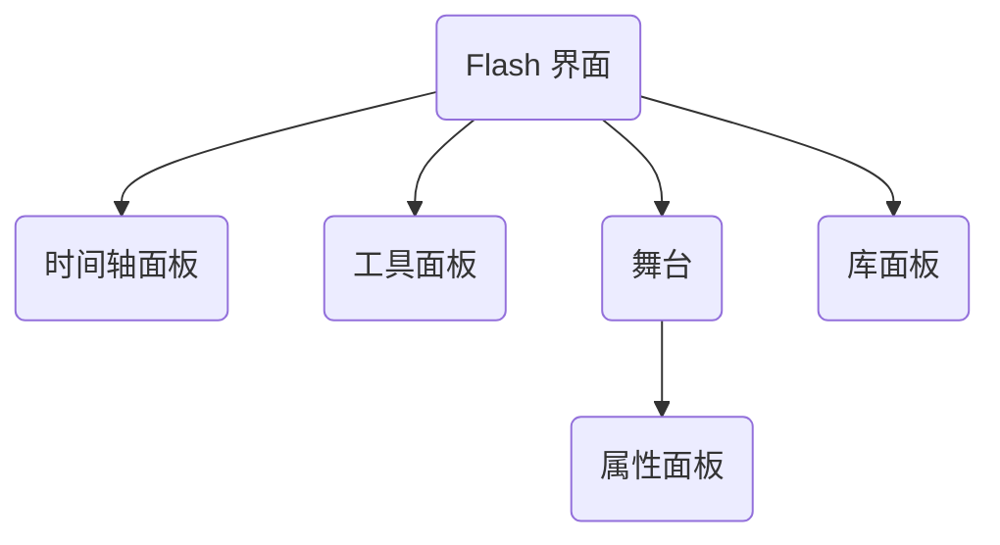
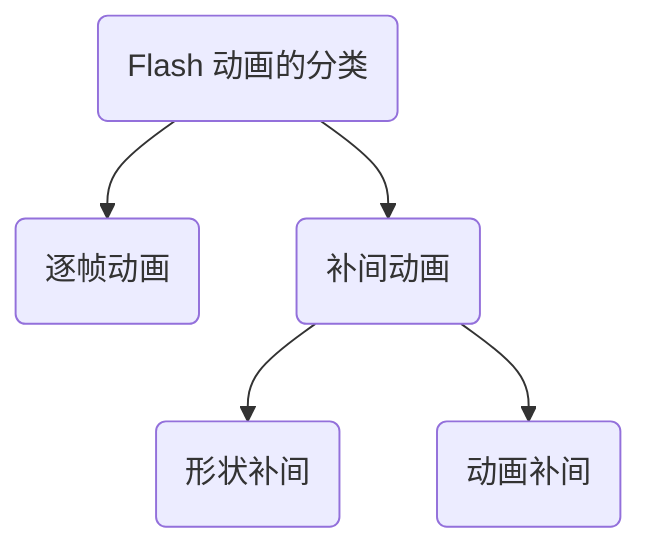
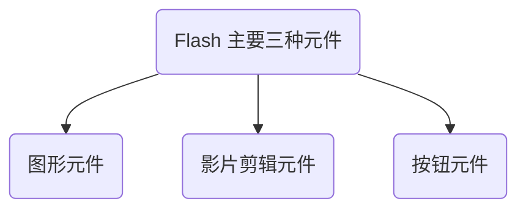

---
last_update:
  date: 1701871923969
---

动画的基本原理：**视觉暂留原理**。

- **时间轴面板**：用来显示图形等内容的时间，也可以指定舞台上各图形的分层顺序。**位于较高图层中的图形显示在较低图层中的图形的上方**。
- **工具面板**：使用面板中的工具可以绘图、上色、选择和修改插图等，并可以更改舞台的视图。
- **舞台**：**创建播放动画内容的区域**，即动画在回放过程中显示图形、视频、按钮等内容的位置。
  - **属性面板**：中可以设置舞台大小、舞台背景颜色、动画播放频率（帧频 fps）等。
- **库面板**：**存放 Flash 文档中的媒体元素的位置**。如果把舞台比作演员演出的地方，那么，库相当于演员的化妆间，演员（库中的媒体元素）只有出现在舞台上观众才可以看到。

Flash **动画文件** 的扩展名是 `.fla`，**影片文件** 的扩展名是 `.swf`。

- **帧**：Flash 时间轴上的 **每一小格叫做“一帧”**。帧代表着 **某个时刻的画面**，不同的帧就是不同时刻的画面。

  - **关键帧**：**有画面内容** 的那一帧叫做“关键帧”，用 **实心小圆** 表示。一个个连续的关键帧快速切换就形成了一段“逐帧动画”。
  - **空白帧**：**动画结束后**，无任何内容的帧叫做“空白帧”，一般显示为 **白色**。
  - **空白关键帧**：用 **空心小圆** 表示。**空白关键帧的编辑区内无任何图形、图像、组合、元件等对象**（可以有声音和命令），一般用于截断前面帧里的内容显示。
  - **延长帧**：用 **空心矩形** 表示。它跟在 **关键帧之后**，将关键帧的内容原样延时显示到该帧。
  - **普通帧**：在关键帧和延长帧间显示为 **灰色**，在空白关键帧和延长帧之间显示为 **白色** 的帧。
  - **过渡帧**：当关键帧或空白关键帧添加了 **补间动画后**，关键帧或空白关键帧后面的普通帧变为过渡帧。

**帧频（fps）**：**单位时间内播放帧的多少**。在 Flash 中，**默认 12 帧**。

- 帧频 **调大**（即每秒播放的图片数 **变多**），动画播放的 **速度变快**；
- 帧频 **调低**（即每秒播放的图片数 **减少**），动画播放时 **速度变慢**。

**图层**：是构成图像或动画的重要组成单位，在 Flash 中，各个图层 **相对独立**，修改其中一层，**不会影响到其他的图层**。

- **逐帧动画**：**每一帧都是关键帧**，每一帧的画面都不同。工作量大，且 Flash 为保存每一帧完整的值，**生成的文件很大**，但所表现的动画过程较 **细腻**。
- **补间动画**：只定义 **相邻两个关键帧** 的画面，中间渐变过程由计算机自动完成。

  - **形状补间动画**：创建由一种形状 A 变为另外一种形状 B 的 **变形效果** 的动画。

    :::warning
    需要对象基于 **矢量图形**。  
    **文字、位图** 需 **分离** 操作。  
    **分离的方法** 是选择菜单 **修改** $\to$ **分离**。  
    形状补间的时间轴背景颜色是 **浅绿色**。
    :::

  - **动画补间动画**：对于某个对象的 **移动、旋转或颜色的淡入淡出** 等效果。

    :::warning
    它是对象 **非形状的渐变**。  
    对象需处于 **整体** 状态。  
    动画补间的时间轴背景颜色是 **淡紫色**。
    :::

- **图形元件**：可用于 **静态图像**，并可用来创建连接到主时间轴的可重用动画片段。
- **影片剪辑元件**：**创建可重用的动画片段**。影片剪辑拥有自己 **独立于主时间轴的多帧或多层时间轴**，即影片剪辑的 **播放不受其他 Flash 动画的影响**。适用于那种在 **主影片已经停止但仍需要继续运行的动画**。
- **按钮元件**：创建响应 **鼠标单击、经过或其他动作的交互式按钮**。可以定义与各种按钮状态关联的图形，然后将动作指定给按钮实例。

- **元件的特点**
  - 元件是指 Flash 动画中的 **独立元素**，可以是文字、图形、按钮、动画片段等。
  - 元件一旦被创建，Flash 将会 **自动地把它添加到库里**，从而可以在 **多个 Flash 文件中重复使用**。
  - 元件被重复使用 **不会增加文件的大小**。使用元件可以减小 Flash 最终输出动画文件的大小。
  - 在播放 Flash 动画的时候，**元件只需下载一次**，有利于动画文件在互联网上的 **传递与播放**。
