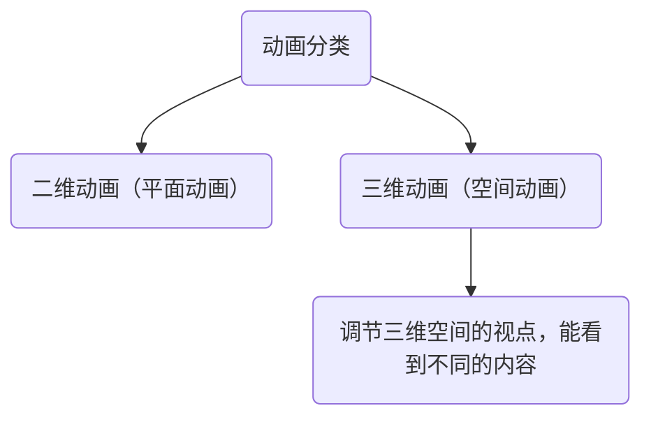
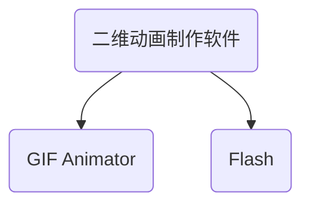
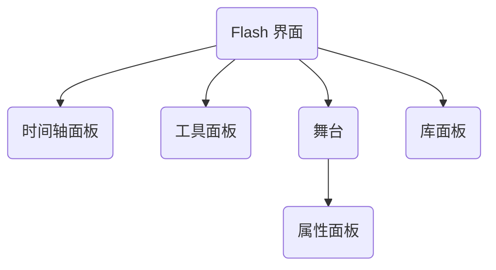
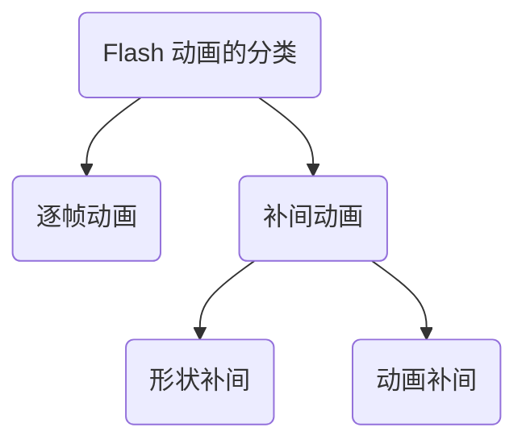

---
last_update:
  date: 1701590322358
---

动画的基本原理：**视觉暂留原理**。

逐帧动画是 **传统** 的动画形式，需要绘制每帧的画面，工作量大。逐帧动画适合描述细微、不规则的动画效果。

- **时间轴面板**：用来显示图形等内容的时间，也可以指定舞台上各图形的分层顺序。**位于较高图层中的图形显示在较低图层中的图形的上方**。
- **工具面板**：使用面板中的工具可以绘图、上色、选择和修改插图等，并可以更改舞台的视图。
- **舞台**：**创建播放动画内容的区域**，即动画在回放过程中显示图形、视频、按钮等内容的位置。
  - **属性面板**：中可以设置舞台大小、舞台背景颜色、动画播放频率（帧频 fps）等。
- **库面板**：**存放 Flash 文档中的媒体元素的位置**。如果把舞台比作演员演出的地方，那么，库相当于演员的化妆间，演员（库中的媒体元素）只有出现在舞台上观众才可以看到。

Flash **动画文件** 的扩展名是 `.fla`，**影片文件** 的扩展名是 `.swf`

- **帧**：Flash 时间轴上的 **每一小格叫做“一帧”**。帧代表着 **某个时刻的画面**，不同的帧就是不同时刻的画面
  - **关键帧**：**有画面内容** 的那一帧叫做“关键帧”，用 **实心小圆** 表示。一个个连续的关键帧快速切换就形成了一段“逐帧动画”。
  - **空白帧**：**动画结束后**，无任何内容的帧叫做“空白帧”，一般显示为 **白色**。

**帧频（fps）**：**单位时间内播放帧的多少**。在 Flash 中，**默认 12 帧**。

- 帧频 **调大**（即每秒播放的图片数 **变多**），动画播放的 **速度变快**；
- 帧频 **调低**（即每秒播放的图片数 **减少**），动画播放时 **速度变慢**。

**图层**：是构成图像或动画的重要组成单位，在 Flash 中，各个图层 **相对独立**，修改其中一层，**不会影响到其他的图层**。

- **逐帧动画**：**每一帧都是关键帧**，每一帧的画面都不同。工作量大，且 Flash 为保存每一帧完整的值，**生成的文件很大**，但所表现的动画过程较 **细腻**。
- **补间动画**：只定义 **相邻两个关键帧** 的画面，中间渐变过程由计算机自动完成。
