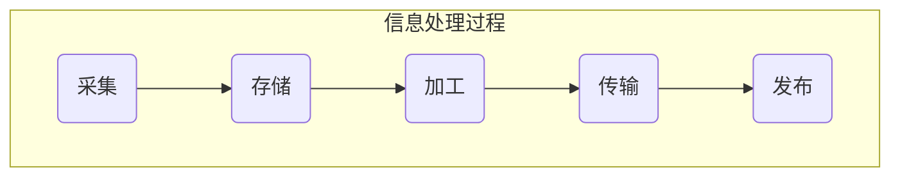
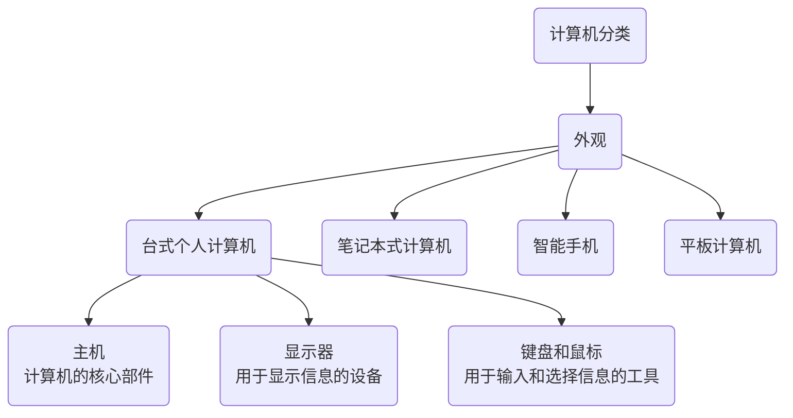
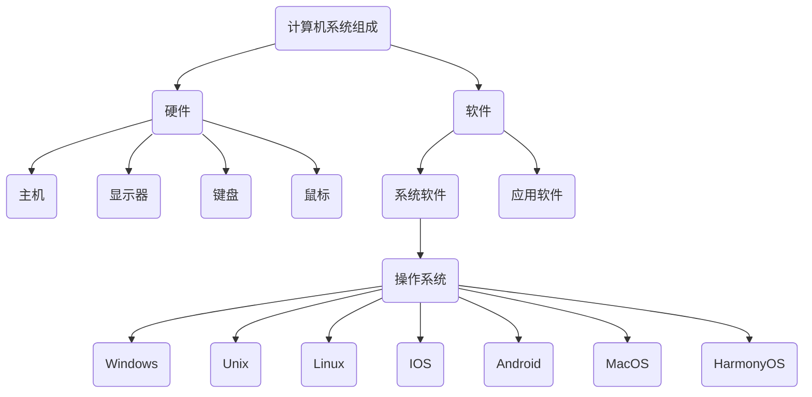

---
last_update:
  date: 1701590322378
---

**基本素养**：**计算思维** 成为每一个人应具备的基本素养。

**信息**：**特定的媒体** 所承载的 **消息、情报、指令、数据** 和信号中所包含的 **一切可传递和可交换的内容**。通常，信息可以通过 **文字、数字、符号、图像、声音、视频** 等不同的方式呈现，是一种资源。

计算机是信息处理的最基本、最重要的工具。

操作系统 Windows、Unix、Linux、iOS、Android（安卓）、HarmonyOS（鸿蒙）

- 硬件
  - **打印机** 将输出结果（文字、图形）打印在纸上，是一种 **输出设备**。
  - **绘图仪** 是一种输出图形的设备，是一种 **输出设备**。
  - **扫描仪** 可以将照片和印刷文本等输入计算机内，是一种 **输入设备**。
  - **数码相机** 是一种图像获取设备，是一种 **输入设备**。
  - **触摸屏** 是一种显示、输入、定位设备，**集显示器、键盘和鼠标的功能于一体**，是 **输入设备、输出设备**。
- 软件
  - **操作系统**：计算机中最基本、最重要的系统软件。
    1. 管理和控制计算机的硬件与软件资源；
    2. 为用户使用计算机提供一个方便易用的环境。
  - **应用软件**：指为解决特定的问题而设计的各种程序及有关文档资料
    - **常用软件**：WPS、Word、Excel、PowerPoint、Flash、Frontpage、QQ、微信
